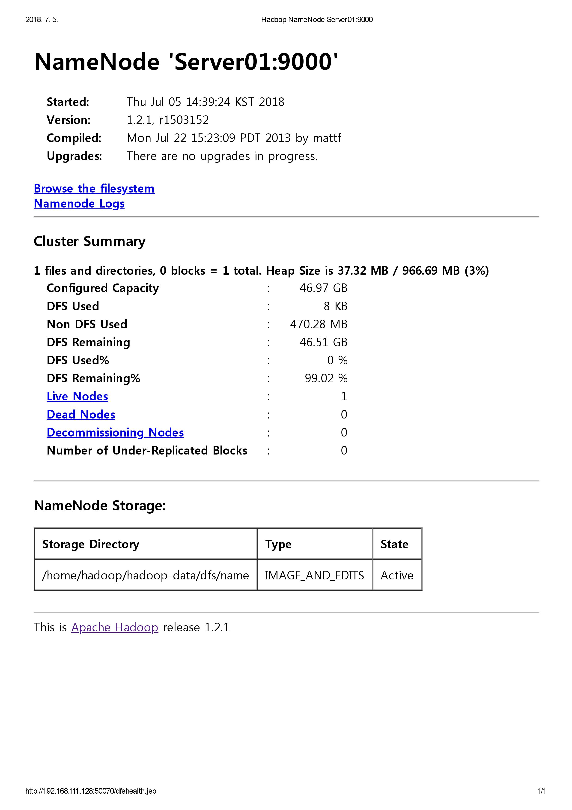
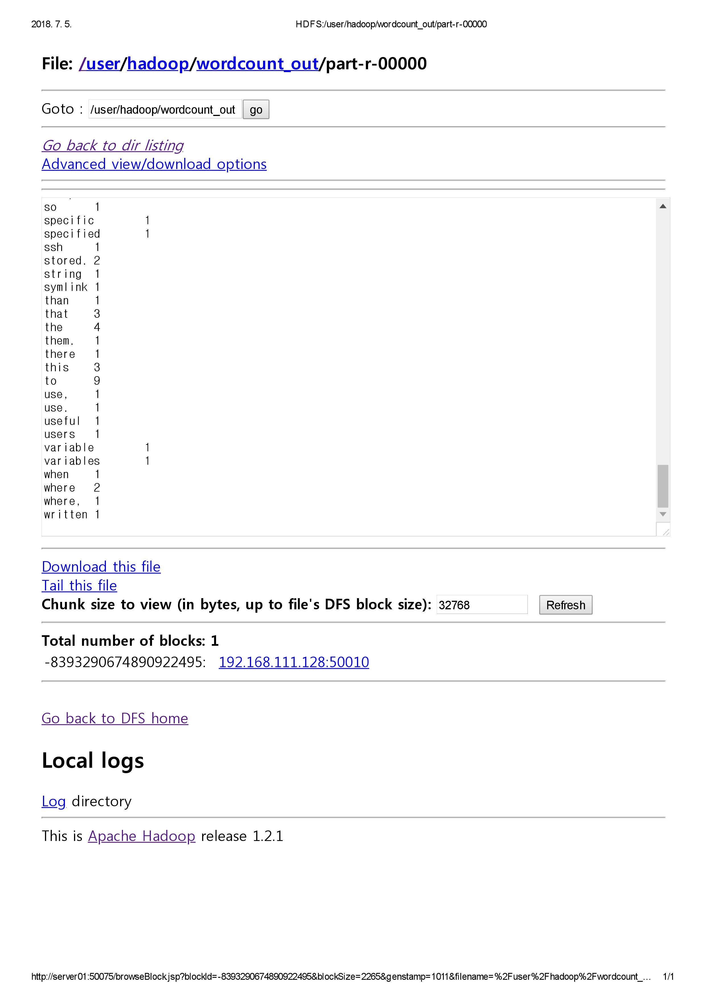

# Hadoop Tutorial


[TOC]

## Hadoop 1.0

### 환경 설정

#### 실습 환경

다음과 같은 사양의 장비 3대로 테스트하였다.

> - CPU: 4 core
> - RAM: 768MB
> - HDD: 100GB
> - OS: CentOS 7 (64bit)
> - Hadoop 1.2.1
> - jdk 1.7


#### SSH

하둡의 서버간 SSH 통신을 위해 hosts 파일을 수정해야 한다. 이 설정은 모든 서버에 동일하게 적용되어야 한다.

```shell
# vi /etc/hosts
192.168.111.x Server01
192.168.111.x Server02
192.168.111.x Server03
```

네임노드가 설치되는 Server01의 공개키(.ssh/id_rsa.pub)를 Server02와 Server03으로 복사한다. 각 서버의 .ssh/authorized_keys 파일에 추가해주면 된다.

이 설정을 마치면 암호를 입력하지 않아도 ssh 접속이 가능하다.


#### conf/

conf 디렉터리의 하둡 환결설정 파일을 수정한다. 테스트 환경에 필요한 최소한의 property만 설정하였다.

- hadoop-env.sh

  - `JAVA_HOME`: 하둡은 java로 개발되어 데몬을 구동할 때 jar 파일을 수정하므로 자바를 필요로 한다. java 사용을 위한 jdk 설치 경로를 지정한다.
  - `HADOOP_PID_DIR`: 하둡 데몬의 PID 정보를 저장하는 디렉터리의 기본값 /tmp를 하둡 설치 경로의 /pids로 변경한다.

  ```sh
  # jdk location
  export JAVA_HOME=/usr/java/default
  
  # hadoop demon pids
  export HADOOP_PID_DIR=/home/hadoop/hadoop-1.2.1/pids
  ```

- masters

  보조네임노드를 실행할 서버를 설정한다. 테스트 환경이므로 네임노드와 보조네임노드를 같은 서버에 설치했다. 실제 서비스에서는 장애 발생에 대비하기 위해 별도의 서버에 설치하는 것이 권장된다.

  ```
  Server01
  ```

- slaves

  데이터노드를 실행할 서버를 설정한다.

  ```
  Server02
  Server03
  ```

- core-site.xml

  - `fs.default.name`: HDFS의 기본 이름. 네임노드를 호출할 때 이 값을 참조한다.
  - `hadoop.tmp.dir`: 하둡에서 발생하는 임시 데이터를 저장한다.

  ```xml
  <configuration>
      <property>
          <name>fs.default.name</name>
          <value>hdfs://Server01:9000</value>
      </property>
      <property>
          <name>hadoop.tmp.dir</name>
          <value>/home/hadoop/hadoop-data</value>
      </property>
  </configuration>
  ```

- hdfs-site.xml

  - `dfs.replication`: HDFS에 저장될 데이터의 복제본 개수. 본 실습에서는 완전 분산 모드로 하둡을 구성하므로 값을 3으로 설정하였다.
  - `dfs.http.address`: 네임노드용 웹서버의 주소값. 완전 분산 모드로 구성할 경우 반드시 이 속성을 설정해야 한다.
  - `dfs.secondary.http.address`: 보조네임노드용 웹서버의 주소값.

  ```xml
  <configuration>
      <property>
          <name>dfs.replication</name>
          <value>3</value>
      </property>
      <property>
          <name>dfs.http.address</name>
          <value>Server01:50070</value>
      </property>
      <property>
          <name>dfs.secondary.http.address</name>
          <value>Server01:50090</value>
      </property>
  </configuration>
  ```

- mapred-site.xml

  - `mapred.job.tracker`: JobTracker 데몬의 주소값. 데이터노드에서 이 주소로 맵리듀스 작업을 요청한다.

  ```xml
  <configuration>
      <property>
          <name>mapred.job.tracker</name>
          <value>Server01:9001</value>
      </property>
  </configuration>
  ```


네임노드에서 모든 수정 작업이 완료되면 모든 데이터노드 서버로 환경설정 파일을 전송한다.

```shell
scp * Server02:/home/hadoop/hadoop-1.2.1/conf/
scp * Server03:/home/hadoop/hadoop-1.2.1/conf/
```


### 하둡 실행

1. 네임노드를 초기화하기 위해 포맷한다.

   ```shell
   bin/hadoop namenode -format
   ```

2. 다음 각 명령어를 통해 dfs와 mapred 각각 또는 전체를 실행하거나 멈출 수 있다.

   ```shell
   # dfs
   bin/start-dfs.sh
   bin/stop-dfs.sh
   
   # mapred
   bin/start-mapred.sh
   bin/stop-mapred.sh
   
   # all
   bin/start-all.sh
   bin/stop-all.sh
   ```

3. `jps` 명령어로 하둡 데몬의 실행 여부를 확인한다.

   ```shell
   # Server01
   2756 NameNode
   2933 SecondaryNameNode
   3286 Jps
   3160 JobTracker
   
   # Server02
   2980 Jps
   2874 TaskTracker
   2619 DataNode
   
   # Server03
   2528 DataNode
   2785 TaskTracker
   2903 Jps
   ```

   

   | Hostname | Node                        | Tracker     |
   | -------- | --------------------------- | ----------- |
   | Server01 | NameNode, SecondaryNameNode | JobTracker  |
   | Server02 | DataNode                    | TaskTracker |
   | Server03 | DataNode                    | TaskTracker |

4. 하둡은 HDFS 정보를 확인할 수 있는 웹 인터페이스를 제공한다. http://Server01:50070 으로 접근할 수 있다. IP가 아닌 호스트명으로 접근하기 위해서는 hosts 파일 설정이 필요하다.

   


### 예제 실행

하둡이 제공하는 예제 코드 중 wordcount 프로그램을 실행해 보았다.

1. hadoop-env.sh 파일의 단어 개수를 계산하고자 한다. 먼저 파일을 HDFS에 업로드한다.

   ```shell
   bin/hadoop fs -put conf/hadoop-env.sh conf/hadoop-env.sh
   ```

2. wordcount 클래스를 실행하고 결과를 출력한다.

   ```shell
   bin/hadoop jar hadoop-examples-*.jar wordcount conf/hadoop-env.sh wordcount_output
   ```

3. 터미널에서 결과를 확인한다.

   ```shell
   bin/hadoop fs -cat wordcount_output/part-r-00000
   ```

4. 웹 인터페이스를 통해서도 확인할 수 있다. Browse the filesystem 링크를 클릭하면 /user/hadoop/wordcount_output/part-r-00000 경로에서 확인할 수 있다.

   


## Hadoop 2.0

### 환경 설정

#### 실습 환경

> - CPU: 4 core
> - RAM: 768MB
> - HDD: 100GB
> - OS: CentOS 7 (64bit)
> - Hadoop 2.7.6
> - jdk 1.8
> - protobuf-2.5.0

리눅스 서버, JDK 설치, 하둡 계정 생성, SSH 인증과 같은 설정 작업은 하둡 1.0과 같으므로 생략한다.

#### 프로토콜 버퍼

프로토콜 버퍼는 구글의 오픈소스 직렬화 라이브러리이다. 바이너리 데이터를 이용하여 데이터 통신하는 방식을 지원한다. 하둡 2.0에서는 내부 데몬 간의 데이터 통신에서 프로토콜 버퍼를 사용한다. 따라서 하둡 2.0을 실행하려면 프로토콜 버퍼를 설치해야 한다.

```shell
# source code
wget https://github.com/google/protobuf/releases/download/v2.5.0/protobuf-2.5.0.tar.gz
cd /usr/local
tar xvfz protobuf-2.5.0.tar.gz
cd protobut-2.5.0
# compile
./configure
make
make install
# check version
protoc --version
```


#### conf/

하둡 2.0에서도 마찬가지로 환경설정 파일을 수정한다.

- hadoop-env.sh

  하둡을 실행하는 셸 스크립트 파일에 필요한 환경변수를 설정한다.

  ```sh
  # jdk location
  export JAVA_HOME=/usr/java/default
  # hadoop demon pids
  export HADOOP_PID_DIR=/home/hadoop/hadoop-2.7.6/pids
  ```

- masters

  네임노드 HA를 구성할 경우 스탠바이 네임노드가 세컨더리 네임노드를 대체한다. 가상분산모드로 설치할 경우에는 네임노드 HA를 구성할 수 없기 때문에 세컨더리 네임노드 실행을 위해 masters 파일을 새로 생성해야 한다.

  ```
  Server01
  ```

- slaves

  데이터 노드의 호스트 목록을 작성한다.

  ```
  Server02
  Server03
  ```

- core-site.xml

  - `fs.dafaultFS`: HDFS의 기본 이름. 네임노드를 호출할 때 이 값을 참조한다.
  - `hadoop.tmp.dir`: 하둡에서 발생하는 임시 데이터를 저장한다.

  ```xml
  <configuration>
      <property>
          <name>fs.defaultFS</name>
          <value>hdfs://Server01:9000</value>
      </property>
      <property>
          <name>hadoop.tmp.dir</name>
          <value>/home/hadoop/tmp/hadoop-${user.name}</value>
      </property>
  </configuration>
  ```

- hdfs-site.xml

  - `dfs.replication`: HDFS에 저장될 데이터의 복제본 개수.
  - `dfs.namenode.name.dir`: 파일 시스템 이미지를 저장할 로컬 파일 시스템 경로
  - `dfs.namenode.checkpoint.dir`: 세컨더리 네임노드의 체크포인팅 데이터를 저장할 로컬 파일 시스템 경로
  - `dfs.datanode.data.dir`: 데이터 블록을 저장할 로컬 파일 시스템 경로

  ```xml
  <configuration>
      <property>
          <name>dfs.replication</name>
          <value>3</value>
      </property>
      <property>
          <name>dfs.namenode.name.dir</name>
          <value>/home/hadoop/data/dfs/namenode</value>
      </property>
      <property>
          <name>dfs.namenode.checkpoint.dir</name>
          <value>/home/hadoop/data/dfs/namesecondary</value>
      </property>
      <property>
          <name>dfs.datanode.data.dir</name>
          <value>/home/hadoop/data/dfs/datanode</value>
      </property>
  </configuration>
  ```

- mapred-site.xml

  - `mapreduce.framework.name`: 맵리듀스 잡을 실행할 모드를 설정한다. 로컬(local) 모드 또는 얀(yarn) 모드가 있다.

  ```xml
  <configuration>
      <property>
          <name>mapreduce.framework.name</name>
          <value>yarn</value>
      </property>
  </configuration>
  ```

- yarn-site.xml

  - `yarn.nodemanager.aux-services`: 노드매니저 간의 서비스 제어를 위한 AuxiliaryService로 사용할 명칭을 정의한다.
  - `yarn.nodemanager.aux-services.mapreduce_shuffle.class`: AuxiliaryService의 클래스를 설정한다.
  - `yarn.nodemanager.local-dirs`: 노드매니저가 애플리케이션을 실행할 때 필요한 파일을 저장하는 로컬 파일 시스템 경로
  - `yarn.resourcemanager.fs.state-store.uri`: 리소스매니저의 상태 정보를 저장할 로컬 파일 시스템 경로
  - `yarn.resourcemanager.hostname`: 리소스매니저의 호스트명
  - `yarn.web-proxy.address`: 얀에서 제공하는 웹 프록시 서버 주소

  ```xml
  <configuration>
      <property>
          <name>yarn.nodemanager.aux-services</name>
          <value>mapreduce_shuffle</value>
      </property>
      <property>
          <name>yarn.nodemanager.aux-services.mapreduce_shuffle.class</name>
          <value>org.apache.hadoop.mapred.ShuffleHandler</value>
      </property>
      <property>
          <name>yarn.nodemanager.local-dirs</name>
          <value>/home/hadoop/data/yarn/nm-local-dir</value>
      </property>
      <property>
          <name>yarn.resourcemanager.fs.state-store.uri</name>
          <value>/home/hadoop/data/yarn/system/rmstore</value>
      </property>
      <property>
          <name>yarn.resourcemanager.hostname</name>
          <value>Server01</value>
      </property>
      <property>
          <name>yarn.web-proxy.address</name>
          <value>0.0.0.0:8089</value>
      </property>
  </configuration>
  ```


### 하둡 실행

1. 네임노드 초기화

   ```shell
   bin/hdfs namenode -format
   ```

2. 다음 각 명령어를 통해 dfs와 yarn을 각각 실행하거나 멈출 수 있다. 전체를 실행하는 `sbin/start-all.sh` 와 `sbin/stop-all.sh` 명령어는 deprecated 상태로 향후 호환성을 보장하지 않는다.

   ```shell
   # dfs
   sbin/start-dfs.sh
   sbin/stop-dfs.sh
   
   # yarn
   sbin/start-yarn.sh
   sbin/stop-yarn.sh
   ```

3. `jps` 명령어로 하둡 데몬의 실행 여부를 확인한다.

   ```shell
   # Server01
   12683 Jps
   11950 NameNode
   12158 SecondaryNameNode
   12398 ResourceManager
   
   # Server02
   36048 NodeManager
   36214 Jps
   35836 DataNode
   
   # Server03
   35762 Jps
   35371 DataNode
   35583 NodeManager
   ```

   

   | Hostname | Node                        | Manager         |
   | -------- | --------------------------- | --------------- |
   | Server01 | NameNode, SecondaryNameNode | ResourceManager |
   | Server02 | DataNode                    | NodeManager     |
   | Server03 | DataNode                    | NodeManager     |

4. 마찬가지로 http://Server01:50070 으로 웹 인터페이스에 접근할 수 있다. 그 밖에 얀과 관련된 웹 인터페이스는 http://Server01:8088 에서 제공되며, 맵 리듀스 잡 히스토리 서버는 http://Server01:19888 에서 제공된다.


### 예제 실행

wordcount 예제를 실행해 본다.

1. 데이터를 저장할 디렉터리를 생성한다. 하둡 2.0에서는 /user 디렉터리도 직접 생성해야 한다.

   ```shell
   bin/hdfs dfs -mkdir /user
   bin/hdfs dfs -mkdir /user/hadoop
   bin/hdfs dfs -mkdir /user/hadoop/conf
   ```

2. 단어 개수를 계산할 hadoop-env.sh 파일을 업로드한다. 기본적으로 /user/hadoop 경로가 자동으로 지정된다.

   ```shell
   bin/hdfs dfs -put etc/hadoop/hadoop-env.sh conf/
   ```

3. wordcount 클래스를 실행한다.

   ```shell
   bin/yarn jar share/hadoop/mapreduce/hadoop-mapreduce-exampled-2.7.6.jar wordcount conf output
   ```

4. 출력된 결과를 터미널에서 확인한다. 웹 인터페이스의 Browse the filesystem 링크를 통해서도 결과를 확인할 수 있다.

   ```shell
   bin/hdfs dfs -cat output/part-r-00000 | tail -5
   ```

   

## Hadoop 2.0 HA

완전분산모드로 하둡 2.0 네임노드 HA를 구성한다. 이를 위해서 저널노드 실행을 위한 최소 3대 이상의 서버가 필요하다.

### 환경설정

실습환경은 Hadoop 2.0과 동일하므로 생략한다.


#### zookeeper

분산 코디네이터인 주키퍼를 설치하고 압축을 푼다.

```shell
wget "https://archive.apache.org/dist/zookeeper/zookeeper-3.4.10/zookeeper-3.4.10.tar.gz"
tar xvfz zookeeper-3.4.10.tar.gz
```

##### conf/

- zoo.cfg

  - `dataDir`: 주키퍼 스냅샷을 저장하는 경로
  - `server.#`: 멀티서버로 구성할 서버를 등록하는 옵션. '#' 부분에 해당 서버의 아이디를 숫자 또는 원하는 값으로 지정할 수 있다. 첫 번째 포트인 2888은 주키퍼 리더에 접속하기 위한 포트이고, 두 번째 포트인 3888은 리더를 결정하는 데 사용한다.

  ```
  dataDir=/home/hadoop/zookeeper-3.4.19/data
  
  server.1=Server01:2888:3888
  server.2=Server01:2888:3888
  server.3=Server01:2888:3888
  ```

##### data/

- myid

  - 각 서버마다 zoo.cfg에서 설정한 아이디 등록. 다음은 Server01의 myid 파일의 예시이다.

  ```
  1
  ```

주키퍼 환경설정이 완료되면 다른 서버에 전송하여 설치를 완료한다.

각 서버마다 다음 명령어를 통해 주키퍼 서버를 실행 또는 종료할 수 있다.

서버 상태를 보면 leader/follower로 모드가 자동 할당된 것을 확인할 수 있다.

```shell
# server start
bin/zkServer.sh start

# check status
bin/zkServer.sh status

# server stop
bin/zkServer.sh stop
```


#### 하둡 conf/

하둡 2.0의 설정에서 변동이 없는 파일은 생략한다.

- masters

  네임노드 HA를 구성하면 StandbyNameNode가 SecondaryNameNode를 대체한다. masters 파일이 필요없으므로 삭제한다.

- core-site.xml

  - `ha.zookeeper.quorum`: 네임노드 HA를 구성할 때 사용할 주키퍼 서버 주소

  ```xml
  <configuration>
      <property>
          <name>fs.defaultFS</name>
          <value>hdfs://hadoop-cluster</value>
      </property>
      <property>
          <name>ha.zookeeper.quorum</name>
          <value>Server01:2181,Server02:2181,Server03:2181</value>
      </property>
      <property>
          <name>hadoop.tmp.dir</name>
          <value>/home/hadoop/tmp/hadoop-${user.name}</value>
      </property>
  </configuration>
  ```

- hdfs-site.xml

  - `dfs.journalnode.edits.dir`: 저널노드의 데이터
  - `dfs.nameservices`: 네임노드 HA와 HDFS 페더레이션에 사용. 두 개의 네임노드를 묶어서 가상의 파일 시스템 이름을 설정할 수 있다. 본 실습에서는 Server01과 Server02를 묶어서 hadoop-cluster라는 가상 파일 시스템 이름을 설정했다.
  - `dfs.ha.namenodes.[nameservices_id]`: nameservices에서 설정한 네임서비스ID는 두 개의 네임노드ID로 구성된다. 호스트명 대신 논리적인 이름을 부여해서 사용한다. 본 실습에서는 hadoop-cluster가 nn1과 nn2라는 두 개의 네임노드ID로 구성되도록 설정했다.
  - `dfs.namenode.rpc-address.[nameservices_id].[namenode_id]`: 네임노드가 RPC 서비스를 제공하기 위한 RPC 포트 설정값. 네임서비스ID와 네임노드ID라는 논리적인 명칭을 물리적인 호스트명(또는 IP)과 연결되도록 한다. 본 실습에서는 nn1을 Server01로, nn2를 Server02로 설정했다.
  - `dfs.namenode.http-address.[nameservices_id].[namenode_id]`: HDFS 웹 어드민 화면을 제공하기 위한 설정값. RPC 설정과 마찬가지로 설정했다.
  - `dfs.namenode.shared.edits.dir`: 네임노드가 에디트 로그를 저장하고 조회할 저널노드 그룹을 나타낸다. "qjournal://호스트1:포트1;호스트2:포트2/저널ID" 위와 같은 형식으로 작성한다. 이때, 저널ID는 저널노드 그룹의 고유한 식별값을 나타내는데 일반적으로 네임서비스ID와 동일하게 작성한다.
  - `dfs.client.failover.proxy.provider.[nameservices_id]`: 클라이언트가 active namenode에 접근하도록 도와주는 클래스
  - `dfs.ha.fencing.methods`: active namenode에 장애가 발생할 경우 해당 노드는 시스템에서 차단되고 standby namenode가 active namenode로 전환된다. 이때 기존 active namenode가 시스템에 접근할 수 없도록 차단하는 방법을 정의하는 속성값이다. SSH로 강제 종료(kill)하는 방법 또는 별도의 셸 스크립트로 차단하는 방법이 있다. 본 실습에서는 sshfence 방법을 채택하였다.
  - `dfs.ha.fencing.ssh.private-key-files`: 강제 종료 방법 중 sshfence 방식을 채택했다면 SSH 접속 시 인증을 자동으로 통과할 수 있도록 인증키의 보관 경로를 설정해야 한다.
  - `dfs.ha.automatic-failover.enabled`: 네임노드 장애복구를 시스템이 자동으로 진행할지 여부를 설정한다.

  ```xml
  <configuration>
      <property>
          <name>dfs.replication</name>
          <value>3</value>
      </property>
      <property>
          <name>dfs.namenode.name.dir</name>
          <value>/home/hadoop/data/dfs/namenode</value>
      </property>
      <property>
          <name>dfs.namenode.checkpoint.dir</name>
          <value>/home/hadoop/data/dfs/namesecondary</value>
      </property>
      <property>
          <name>dfs.datanode.data.dir</name>
          <value>/home/hadoop/data/dfs/datanode</value>
      </property>
      <property>
          <name>dfs.journalnode.edits.dir</name>
          <value>/home/hadoop/data/dfs/journalnode</value>
      </property>
      <property>
          <name>dfs.nameservices</name>
          <value>hadoop-cluster</value>
      </property>
      <property>
          <name>dfs.ha.namenodes.hadoop-cluster</name>
          <value>nn1,nn2</value>
      </property>
      <property>
          <name>dfs.namenode.rpc-address.hadoop-cluster.nn1</name>
          <value>Server01:8020</value>
      </property>
      <property>
          <name>dfs.namenode.rpc-address.hadoop-cluster.nn2</name>
          <value>Server02:8020</value>
      </property>
      <property>
          <name>dfs.namenode.http-address.hadoop-cluster.nn1</name>
          <value>Server01:50070</value>
      </property>
      <property>
          <name>dfs.namenode.http-address.hadoop-cluster.nn2</name>
          <value>Server02:50070</value>
      </property>
      <property>
          <name>dfs.namenode.shared.edits.dir</name>
          <value>qjournal://Server01:8485;Server02:8485;Server03:8485/hadoop-cluster</value>
      </property>
      <property>
          <name>dfs.client.failover.proxy.provider.hadoop-cluster</name>
          <value>org.apache.hadoop.hdfs.server.namenode.ha.ConfiguredFailoverProxyProvider</value>
      </property>
      <property>
          <name>dfs.ha.fencing.methods</name>
          <value>sshfence
              shell(/bin/true)
          </value>
      </property>
      <property>
          <name>dfs.ha.fencing.ssh.private-key-files</name>
          <value>/home/hadoop/.ssh/id_rsa</value>
      </property>
      <property>
          <name>dfs.ha.automatic-failover.enabled</name>
          <value>true</value>
      </property>
  </configuration>
  ```

- mapred-site.xml

  - `mapreduce.job.ubertask.enable`: 맵리듀스 잡을 구성하는 태스크의 실행 방법을 우버 태스크로 실행하기 위한 설정값

  ```xml
  <configuration>
      <property>
          <name>mapreduce.job.ubertask.enable</name>
          <value>true</value>
      </property>
      <property>
          <name>mapreduce.framework.name</name>
          <value>yarn</value>
      </property>
  </configuration>
  ```

환경 설정이 완료되면 수정한 모든 파일을 각 서버로 배포한다.


### 하둡 실행

가상 분산 모드 실습에서 생성된 /home/hadoop/data 디렉터리를 삭제한다.

0. 각 서버마다 주키퍼를 실행한다.

1. ZKFC를 실행하기 전 주키퍼를 초기화한다.

   ```shell
   bin/hdfs zkfc -formatZK
   ```

2. 각 서버에서 저널노드를 실행한다. 네임노드를 포맷하기 전에 저널노드를 먼저 실행해야만 포맷 명령어를 실행했을 때 공유 에디트 로그 디렉터리가 초기화된다.

   ```shell
   sbin/hadoop-daemon.sh start journalnode
   ```

3. 네임노드를 포맷한다.

   ```shell
   bin/hdfs namenode -format
   ```

4. 액티브 네임노드를 실행한다.

   ```shell
   sbin/hadoop-daemon.sh start namenode
   ```

5. 주키퍼 장애 컨트롤러(ZKFC)를 실행한다.

   ```shell
   sbin/hadoop-daemon.sh start zkfc
   ```

6. 스탠바이 네임노드를 설정한다.

   ```shell
   # Server02
   bin/hdfs namenode -bootstrapStandby
   ```

7. 스탠바이 네임노드를 실행한다.

   ```shell
   # Server02
   sbin/hadhoop-daemon.sh start namenode
   ```

8. 스탠바이 네임노드용 주키퍼 장애 컨트롤러를 실행한다.

   ```shell
   # Server02
   sbin/hadoop-daemon.sh start zkfc
   ```

9. 전체 데이터노드를 실행한다.

   ```shell
   sbin/hadoop-daemons.sh start datanode
   ```

10. `jps` 명령어로 하둡 데몬의 실행 여부를 확인한다.

    ```shell
    # Server01
    30401 NameNode
    30625 JournalNode
    30913 ResourceManager
    25346 QuorumPeerMain
    30811 DFSZKFailoverController
    35771 Jps
    
    # Server02
    27555 DFSZKFailoverController
    27430 JournalNode
    27319 DataNode
    32791 Jps
    23305 QuorumPeerMain
    27241 NameNode
    27662 NodeManager
    
    # Server03
    24787 NodeManager
    24678 JournalNode
    29079 Jps
    24571 DataNode
    21549 QuorumPeerMain
    ```

    

    | Hostname | Node                                     | Manager         | Zookeeper                               |
    | -------- | ---------------------------------------- | --------------- | --------------------------------------- |
    | Server01 | NameNode(Active), JournalNode            | ResourceManager | QuorumPeerMain, DFSZKFailoverController |
    | Server02 | NameNode(Standby), JournalNode, DataNode | NodeManager     | QuorumPeerMain, DFSZKFailoverController |
    | Server03 | JournalNode, DataNode                    | NodeManager     | QuorumPeerMain                          |


### 예제 실행

wordcount 예제를 실행해 본다.

1. 데이터를 저장할 디렉터리를 생성한다.

   ```shell
   hadoop fs -mkdir /user
   hadoop fs -mkdir /user/hadoop
   hadoop fs -mkdir input
   ```

2. 단어 개수를 계산하고 싶은 파일을 업로드한다.

   ```shell
   hadoop fs -put hadoop-2.7.6/etc/hadoop/hadoop-env.sh input/
   ```

3. yarn을 통해 맵리듀스 작업을 실행한다. 제공하는 jar 파일이 아닌 본 실습에서 작성한 jar 파일을 사용하였다.

   ```shell
   yarn jar TestWordCount-0.0.1-SNAPSHOT.jar com.test2.WordCount input output
   ```

4. 출력 결과를 확인한다.

   ```shell
   hadoop fs -cat outupt/*
   ```


## HDFS 명령어

하둡은 HDFS 제어를 위한 셸 명령어를 제공한다. 이 셸 명령어를 fs 셸(File System Shell)이라고 한다. fs 셸은 파일에 대한 권한 부여, 파일 복사 및 삭제뿐만 아니라 hdfs 고유의 파일 복제 정보에 대한 변경과 같은 작업도 지원한다.

```shell
bin/hadoop fs -cmd [args]
```

형식은 위와 같다. cmd는 사용자가 설정한 명령어이고, agrs는 필요한 파라미터이며, args에 생략부호(...)을 사용한 경우 반복 사용이 가능함을 의미한다.

자세한 사항은 `hadoop fs -help`를 통해 확인할 수 있다.

### 파일 목록 보기 - ls, lsr

- ls

  지정한 디렉터리에 있는 파일의 정보 또는 특정 파일을 지정해 정보를 출력한다. 기본 경로는 해당 계정의 홈 디렉터리이다.

  ```shell
  bin/hadoop fs -ls [directory|file...]
  ```

- lsr

  현재 디렉터리의 하위 디렉터리 정보까지 출력한다.

  ```shell
  bin/hadoop fs -lsr [directory|file...]
  ```

### 파일 용량 확인 - du, dus

- du

  지정한 디렉터리나 파일의 사용량을 확인하는 명령어로, 바이트 단위로 결과를 출력한다. 기본 경로를 사용자의 홈 디렉터리이다.

  ```shell
  bin/hadoop fs -du [directory|file...]
  ```

- dus

  각각이 아닌 전체 합계 사용량만 출력한다.

  ```shell
  bin/hadoop fs -dus <directory|file...>
  ```

### 파일 내용 보기 - cat, text

- cat

  지정한 파일의 내용을 화면에 출력한다.

  ```shell
  bin/hadoop fs -cat [file...]
  ```

- text

  텍스트 파일뿐만 아니라 zip 파일 형태의 압축 파일도 텍스트 형태로 화면에 출력한다. 맵리듀스에서 압축된 형식으로 출력 데이터를 생성하는데, 이때 사용하여 데이터를 확인할 수 있다.

  ```shell
  bin/hadoop fs -text [file...]
  ```

### 디렉터리 생성 - mkdir

- mkdir

  지정한 경로에 디렉터리를 생성한다. HDFS에 이미 존재하는 디렉터리를 생성하면 오류가 발생한다.

  ```shell
  bin/hadoop fs -mkdir [directory]
  ```

### 파일 복사 - put, get, getmerge, cp, copyFromLocal, copyToLocal

- put

  지정한 로컬 파일 시스템의 파일 및 디렉터리를 목적지 경로로 복사한다.

  ```shell
  bin/hadoop fs -put [local dir|file...][destination dir|file]
  ```

- get

  HDFS에 저장된 데이터를 로컬 파일 시스템으로 복사한다. 파일 무결성 확인을 위한 체크섬(checksum) 파일을 함께 복사하려면 `-crc` 옵션을 사용한다. `-ignoreCrc` 옵션을 이용하면 해당 파일의 체크섬을 확인하지 않는다.

  ```shell
  bin/hadoop fs -get <-ignoreCrc><-scr>[source dir|file...][local dir|file]
  ```

- getmerge

  지정한 경로에 있는 모든 파일의 내용을 합친 후, 로컬 파일 시스템에 단 하나의 파일로 복사한다.

  ```shell
  bin/hadoop fs -getmerge [source dir|file...][local file]
  ```

- cp

  지정한 소스 디렉터리 및 파일을 목적지 경로로 복사한다. 여러 파일을 복사할 경우 목적지 경로를 디렉터리로 설정해야 한다.

  ```shell
  bin/hadoop fs -cp [source dir|file...][destination dir|file]
  ```

- copyFromLocal

  put 명령어와 동일한 기능

  ```shell
  bin/hadoop fs -copyFromLocal [local dir|file...][destination dir|file]
  ```

- copyToLocal

  get 명령어와 동일한 기능

  ```shell
  bin/hadoop fs -copyToLocal <-ignoreCrc><-crc>[source dir|file...][local dir|file]
  ```

### 파일 이동 - mv, moveFromLocal

- mv

  소스 디렉터리 및 파일을 목적지 경로로 옮긴다.

  ```shell
  bin/hadoop fs -mv [source dir|file...][destination dir|file]
  ```

- moveFromLocal

  put 명령어와 동일하게 동작하지만 로컬 파일 시스템으로 파일이 복사된 후 소스 경로의 파일은 삭제된다.

  ```shell
  bin/hadoop fs -moveFromLocal [source dir|file...][local dir|file]
  ```

### 파일 삭제 - rm

- rm

  지정한 디렉터리나 파일을 삭제한다. 이때, 디렉터리가 반드시 비어 있어야 한다.

  ```shell
  bin/hadoop fs -rm [dir|file...]
  ```

### 디렉터리 삭제 - rmr

- rmr

  지정한 파일 및 디렉터리를 삭제한다. 디렉터리가 비어있지 않더라도 삭제할 수 있다.

  ```shell
  bin/hadoop fs -rmr [dir]
  ```

### 카운트값 조회 - count

- count

  지정한 경로에 대한 전체 디렉토리 개수, 전체 파일 개수, 전체 파일 크기, 지정한 경로명을 출력한다. HDFS는 디렉터리에서 생성할 수 있는 파일 개수나 용량을 제한할 수 있는데 이러한 쿼터 정보를 확인하려면 `-q` 옵션을 사용한다.

  ```shell
  bin/hadoop fs -count <-q>[dir|file...]
  ```

### 파일 마지막 내용 확인 - tail

- tail

  지정한 파일의 마지막 1KB에 해당하는 내용을 출력한다. `-f` 옵션을 사용하면 해당 파일에 내용이 추가될 때마다 화면에 출력된 내용이 갱신된다.

  ```shell
  bin/hadoop fs -tail <-f>[file]
  ```

### 권한 변경 - chmod, chown, chgrp

- chmod

  지정한 경로에 대한 권한을 변경한다. 8진수 표기법 또는 영문 심볼릭 표기법으로 모드를 표현할 수 있다. 권한 변경은 해당 파일 소유자 또는 슈퍼유저만 가능하다. `-R` 옵션을 사용하면 권한 변경을 재귀적으로 실행한다.

  ```shell
  bin/hadoop fs -chmod <-R>[mod...][dir|file...]
  ```

- chown

  지정한 파일과 디렉터리에 대한 소유권을 변경한다. `-R` 옵션을 사용하면 재귀적으로 실행된다.

  ```shell
  bin/hadoop fs -chown <-R>[user:group][dir|file...]
  ```

- chgrp

  지정한 파일과 디렉터리에 대한 소유권 그룹만 변경한다. `-R` 옵션을 사용하면 재귀적으로 실행된다.

  ```shell
  bin/hadoop fs -chgrp <-R>[group][dir|file...]
  ```

### 0 byte 파일 생성 - touch

- touch

  크기가 0바이트인 파일을 생성한다.

  ```shell
  bin/hadoop fs -touch [file...]
  ```

### 통계 정보 조회 - stat

- stat

  지정한 경로에 대한 통계 정보를 조회한다. 별도의 옵션이 없으면 최종 수정된 날짜를 출력한다. 출력 포맷 옵션은 다음과 같다.

  | format | function                                                     |
  | ------ | ------------------------------------------------------------ |
  | %b     | 블록 단위의 파일 크기                                        |
  | %F     | 디렉터리일 경우 "directory", 파일일 경우 "regular file" 출력 |
  | %n     | 디렉터리명 혹은 파일명                                       |
  | %o     | 블록 크기                                                    |
  | %r     | 복제 파일 개수                                               |
  | %y     | 디렉터리 및 파일 갱신일자를 yyyy-MM-dd HH:mm:ss 형식으로 출력 |
  | %Y     | 디렉터리 및 갱신일자를 유닉스 타임스탬프 형식으로 출력       |

  ```shell
  bin/hadoop fs -stat <format>[dir|file...]
  
  # eg.
  bin/hadoop fs -stat %b-%F-%n-%o-%r-%y-%Y wordcount_output
  # 0-directory-wordcount_output-0-0-2014-11-06 16:07:39-1415290059192
  ```

### 복제 데이터 개수 변경 - setrep

- setrep

  지정한 파일의 복제 데이터 개수를 변경한다. `-R` 옵션을 사용할 경우 재귀적으로 적용된다. `-w` 옵션은 변경된 개수를 적용하여 복제가 완료될때까지 대기하도록 한다.

  ```shell
  bin/hadoop fs -setrep <-R><-w>[replication_number][dir|file]
  ```

### 휴지통 비우기 - expunge

- expunge

  휴지통을 비운다. 삭제한 파일은 .Trash/ 라는 임시 디렉터리에 저장한 다음 일정 시간 후 완전히 삭제된다. 삭제 주기와 상관없이 삭제하고자 할 때 사용한다.

  ```shell
  bin/hadoop fs -expunge
  ```

### 파일 형식 확인 - test

- test

  지정한 경로에 대해 다음 옵션을 통해 파일 형식을 확인한다. 체크 결과가 맞을 경우 0을 출력한다.

  | option | check              |
  | ------ | ------------------ |
  | d      | 디렉터리인가?      |
  | e      | 경로가 존재하는가? |
  | f      | 파일인가?          |
  | s      | 비어있지 않은가?   |
  | z      | 파일 크기가 0인가? |

  ```shell
  bin/hadoop fs -test -<defsz> [dir|file]
  ```

  


## Ref.

- 시작하세요! 하둡 프로그래밍 (2nd), 정재화
- [Hadoop documentation - FileSystemShell](https://hadoop.apache.org/docs/r2.7.6/hadoop-project-dist/hadoop-common/FileSystemShell.html)
