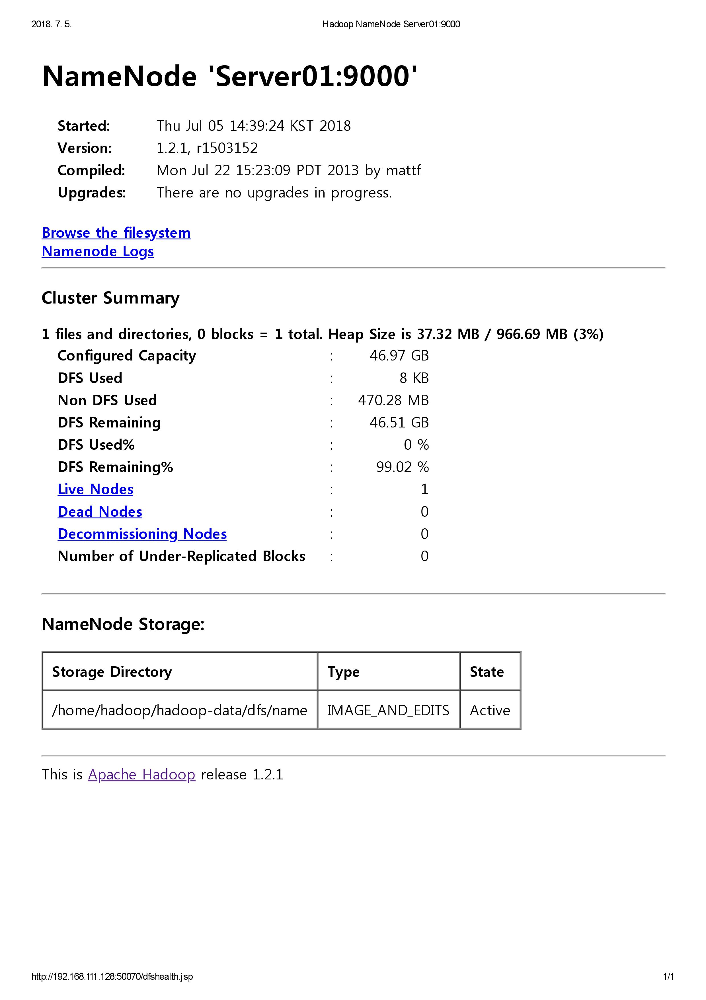

# Hadoop Tutorial


[TOC]

## 환경 설정

### 실습 환경

다음과 같은 사양의 장비 3대로 테스트하였다.

> - CPU: 4 core
> - RAM: 768MB
> - HDD: 100GB
> - OS: CentOS 7 (64bit)
> - Hadoop 1.2.1
> - jdk 1.7


### SSH

하둡의 서버간 SSH 통신을 위해 hosts 파일을 수정해야 한다. 이 설정은 모든 서버에 동일하게 적용되어야 한다.

```shell
# vi /etc/hosts
192.168.111.x Server01
192.168.111.x Server02
192.168.111.x Server03
```

네임노드가 설치되는 Server01의 공개키(.ssh/id_rsa.pub)를 Server02와 Server03으로 복사한다. 각 서버의 .ssh/authorized_keys 파일에 추가해주면 된다.

이 설정을 마치면 암호를 입력하지 않아도 ssh 접속이 가능하다.


### conf

conf 디렉터리의 하둡 환결설정 파일을 수정한다. 테스트 환경에 필요한 최소한의 property만 설정하였다.

- hadoop-env.sh

  - `JAVA_HOME`: 하둡은 java로 개발되어 데몬을 구동할 때 jar 파일을 수정하므로 자바를 필요로 한다. java 사용을 위한 jdk 설치 경로를 지정한다.
  - `HADOOP_PID_DIR`: 하둡 데몬의 PID 정보를 저장하는 디렉터리의 기본값 /tmp를 하둡 설치 경로의 /pids로 변경한다.

  ```sh
  # jdk location
  export JAVA_HOME=/usr/java/default
  
  # hadoop demon pids
  export HADOOP_PID_DIR=/home/hadoop/hadoop-1.2.1/pids
  ```

- masters

  보조네임노드를 실행할 서버를 설정한다. 테스트 환경이므로 네임노드와 보조네임노드를 같은 서버에 설치했다. 실제 서비스에서는 장애 발생에 대비하기 위해 별도의 서버에 설치하는 것이 권장된다.

  ```
  Server01
  ```

- slaves

  데이터노드를 실행할 서버를 설정한다.

  ```
  Server02
  Server03
  ```

- core-site.xml

  - `fs.default.name`: HDFS의 기본 이름. 네임노드를 호출할 때 이 값을 참조한다.
  - `hadoop.tmp.dir`: 하둡에서 발생하는 임시 데이터를 저장한다.

  ```xml
  <configuration>
      <property>
          <name>fs.default.name</name>
          <value>hdfs://Server01:9000</value>
      </property>
      <property>
          <name>hadoop.tmp.dir</name>
          <value>/home/hadoop/hadoop-data</value>
      </property>
  </configuration>
  ```

- hdfs-site.xml

  - `dfs.replication`: HDFS에 저장될 데이터의 복제본 개수. 본 실습에서는 완전 분산 모드로 하둡을 구성하므로 값을 3으로 설정하였다.
  - `dfs.http.address`: 네임노드용 웹서버의 주소값. 완전 분산 모드로 구성할 경우 반드시 이 속성을 설정해야 한다.
  - `dfs.secondary.http.address`: 보조네임노드용 웹서버의 주소값.

  ```xml
  <configuration>
      <property>
          <name>dfs.replication</name>
          <value>3</value>
      </property>
      <property>
          <name>dfs.http.address</name>
          <value>Server01:50070</value>
      </property>
      <property>
          <name>dfs.secondary.http.address</name>
          <value>Server01:50090</value>
      </property>
  </configuration>
  ```

- mapred-site.xml

  - `mapred.job.tracker`: JobTracker 데몬의 주소값. 데이터노드에서 이 주소로 맵리듀스 작업을 요청한다.

  ```xml
  <configuration>
      <property>
          <name>mapred.job.tracker</name>
          <value>Server01:9001</value>
      </property>
  </configuration>
  ```


네임노드에서 모든 수정 작업이 완료되면 모든 데이터노드 서버로 환경설정 파일을 전송한다.

```shell
$ scp * Server02:/home/hadoop/hadoop-1.2.1/conf/
$ scp * Server03:/home/hadoop/hadoop-1.2.1/conf/
```


## 하둡 실행

1. 네임노드를 초기화하기 위해 포맷한다.

   ```shell
   $ bin/hadoop namenode -format
   ```

2. 다음 각 명령어를 통해 dfs와 mapred 각각 또는 전체를 실행하거나 멈출 수 있다.

   ```shell
   # dfs
   $ bin/start-dfs.sh
   $ bin/stop-dfs.sh
   
   # mapred
   $ bin/start-mapred.sh
   $ bin/stop-mapred.sh
   
   # all
   $ bin/start-all.sh
   $ bin/stop-all.sh
   ```

3. 하둡 데몬의 실행 여부를 확인한다.

   ```shell
   # Server01
   $ jps
   2756 NameNode
   2933 SecondaryNameNode
   3286 Jps
   3160 JobTracker
   
   # Server02
   $ jps
   2980 Jps
   2874 TaskTracker
   2619 DataNode
   
   # Server03
   $ jps
   2528 DataNode
   2785 TaskTracker
   2903 Jps
   ```

   

   | hostname | Node                        | Tracker     |
   | -------- | --------------------------- | ----------- |
   | Server01 | NameNode, SecondaryNameNode | JobTracker  |
   | Server02 | DataNode                    | TaskTracker |
   | Server03 | DataNode                    | TaskTracker |

4. 하둡은 HDFS 정보를 확인할 수 있는 웹 인터페이스를 제공한다. http://Server01:50070으로 접근할 수 있다. IP가 아닌 호스트명으로 접근하기 위해서는 hosts 파일 설정이 필요하다.

   


## 예제 실행

하둡이 제공하는 예제 코드 중 wordcount 프로그램을 실행해 보았다.

1. hadoop-env.sh 파일의 단어 개수를 계산하고자 한다. 먼저 파일을 HDFS에 업로드한다.

   ```shell
   $ bin/hadoop fs -put conf/hadoop-env.sh conf/hadoop-env.sh
   ```

2. wordcount 클래스를 실행하고 결과를 출력한다.

   ```shell
   $ bin/hadoop jar hadoop-examples-*.jar wordcount conf/hadoop-env.sh wordcount_output
   ```

3. 터미널에서 결과를 확인한다.

   ```shell
   $ bin/hadoop fs -cat wordcount_output/part-r-00000
   ```

4. 웹 인터페이스를 통해서도 확인할 수 있다. Browse the filesystem 링크를 클릭하면 /user/hadoop/wordcount_output/part-r-00000 경로에서 확인할 수 있다.

   


## Ref.

- 시작하세요! 하둡 프로그래밍 (2nd), 정재화
