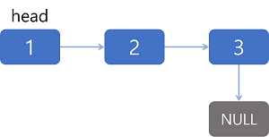
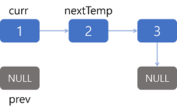
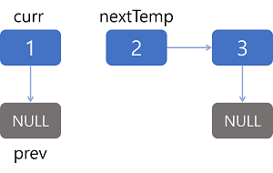
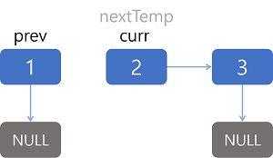
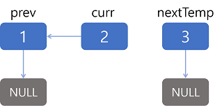
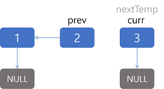
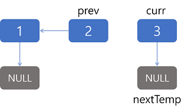
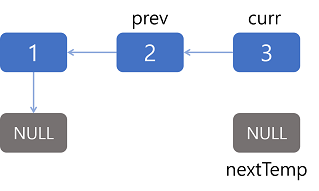
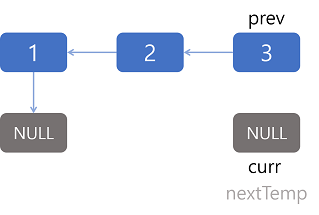
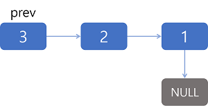

# [Reverse Linked List](https://leetcode.com/problems/reverse-linked-list/)

## Solution

### Leetcode solution

#### Approach 1: Iterative



리스트 1 → 2 → 3 → null을 null ← 1 ← 2 ← 3으로 바꾸려 한다.

그러려면 리스트를 돌면서 현재 노드(curr)의 next 포인터가 이전 노드(prev)를 가리키도록 해야 한다. 변경하기 전에 다음 노드(nextTemp)를 임시로 저장할 필요가 있다.

1. prev는 null, curr는 head, nextTemp는 curr.next로 설정한다.

    

2. curr.next가 prev를 가리키도록 한다.

    

3. prev는 curr로 curr는 nextTemp로 변경한다.

    

4. curr이 null이 될 때까지 위의 과정을 반복한다.

    

    

    

    

    

    

5. 최종 head인 prev를 반환한다.

    

* O(n) time complexity
    n개의 원소가 있는 리스트를 1번 순회한다.
* O(1) time complexity

```java
public ListNode reverseList(ListNode head) {
    ListNode prev = null;
    ListNode curr = head;
    while (curr != null) {
        ListNode nextTemp = curr.next;
        curr.next = prev;
        prev = curr;
        curr = nextTemp;
    }
    return prev;
}
```

## Ref

* [leetcode - solution of reverse linked list](https://leetcode.com/problems/reverse-linked-list/solution/)
* [youtube - GeeksforGeeks](https://youtu.be/D7y_hoT_YZI)