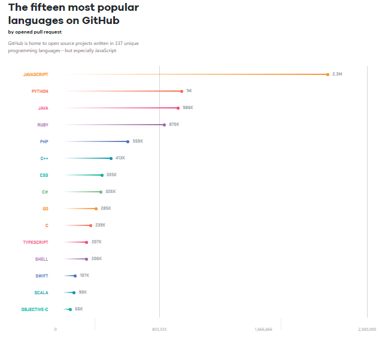
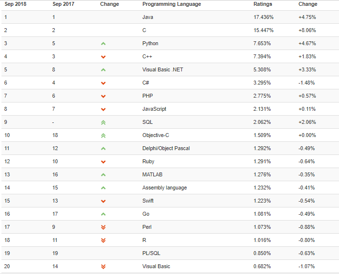
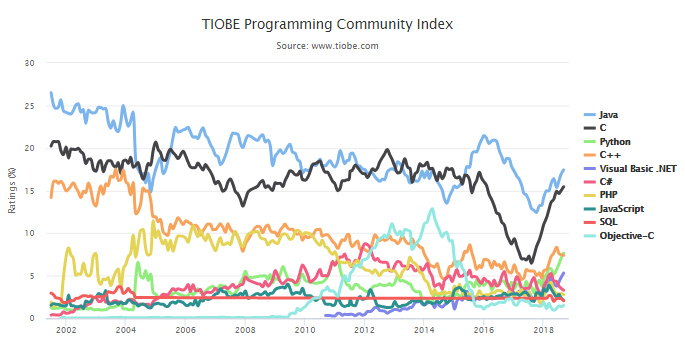

# Ch 1 웹 프로그래밍 기초

## 1 Web 개발의 이해 - FE/BE

### 1.1 웹 프로그래밍을 위한 프로그램 언어들

#### 1.1.1 저급 언어

기계 중심의 언어

컴퓨터의 전기신호인 켜졌다(on)와 꺼졌다(off) 2가지 상태 값으로 동작한다. 숫자로 표현하면 켜졌다는 1, 꺼졌다는 0을 뜻한다.

0과 1로 표현되는 2진수로 작성하는 프로그래밍 언어를 기계어(Machine Language)라 한다.

사람이 이해하기 쉽도록 숫자와 1:1로 대응되는 기호를 사용하는 프로그래밍 언어를 어셈블리어(Assembly Language)라 한다.

이렇게 작성한 어셈블리어를 기계가 알아들을 수 있는 원래 숫자로 바꿔주는 도구를 어셈블러(Assembler)라 한다.

기계어와 어셈블리어는 프로그래밍과 유지보수가 어렵기 때문에 현재는 다음에 소개할 고급 언어를 주로 사용한다.

#### 1.1.2 고급 언어

사람 중심의 언어

사람이 이해하기 쉬운 문법을 사용하는 다양한 프로그래밍 언어가 존재한다.

* FORTRAN: 최초의 고급 언어. 과학 계산용. 공대에서 사용.
* COBOL: 역사가 오래된 언어. 일반 업무용. 은행에서 사용.
* PROLOG: 논리형 프로그래밍 언어.
* C: 1972년 미국 벨 연구소의 데니스 리치가 개발한 고급 언어. 시스템 프로그래밍에 적합.
* Erlang: 스웨덴의 에릭슨이 개발한 함수형 병행성 언어. 통신 인프라 구현에 적합.
* Lisp: FORTRAN 다음으로 오래된 역사의 함수형 언어.
* Swift: 2014년 WWDC에서 공개한 모던 프로그래밍 언어.
* Kotlin: 2011년 JetBrains에서 개발한 모던 프로그래밍 언어. JVM 기반으로 JAVA와 상호 운영이 100& 지원됨.
* Clojure: 리치 히키가 개발한 Lisp 언어의 방언으로 범용 함수형 언어.
* Python: 입문자에게 적합한 언어. 데이터 과학, 웹사이트 개발, 머신 러닝에 적합.
* JAVA: 1995년 Sun Microsystems에서 개발한 객체지향 프로그래밍 언어.

고급 언어도 마찬가지로 작성한 코드를 번역해주는 도구가 필요하다. 이를 컴파일러(Compiler)라 한다.

#### 1.1.3 인기 있는 프로그래밍 언어

* Github Octovers 2017



* TIOBE Index





#### 1.1.4 웹 관련 인기 언어

* Python: 프로그래밍 입문자가 배우기 쉬운 언어로 웹사이트 개발에서 많이 사용된다.
* PHP: 웹의 80% 이상이 PHP로 만들어졌다고 할 정도로 많이 사용되는 언어이다.
* JavaScript: 처음에는 브라우저에서 동작하는 언어였지만 현재는 서버에서도 작성되며 영역을 넓혀가고 있다. 프론트엔드 개발자라면 반드시 익혀야 한다.
* JAVA: 엔터프라이즈 소프트웨어 환경 즉, 큰 규모의 소프트웨어 개발에 주로 사용되는 언어이다. JAVA를 지원하는 수많은 커뮤니티가 존재한다.
* Ruby: 빠르게 개발하고자 할 때 사용되는 언어로 단순하고 세련된 웹 어플리케이션을 만들 수 있다.

#### 1.1.5 참고 링크

* [Github Octovers 2017](https://octoverse.github.com/)
* [TIOBE Index - The Software Quality Company](https://www.tiobe.com/tiobe-index/)
* [프로그램 언어의 종류](https://opentutorials.org/course/2471/13907)

### 1.2 웹의 동작 (HTTP 프로토콜 이해)

#### 1.2.1 인터넷(네트웍 통신)의 이해

인터넷 != WWW(World Wide Web)

WWW는 인터넷을 기반으로 한 대표적인 서비스 중 하나이다. 그 외의 서비스들을 살펴보면 다음과 같다.

| 이름 | 프로토콜 | 포트 | 기능 |
|---|---|---|---|
| WWW | HTTP | 80 | 웹 서비스 |
| Email | SMTP/POP3/IMAP | 25/110/114 | 이메일 서비스 |
| FTP | FTP | 21 | 파일 전송 서비스 |
| DNS | DNS | 23 | 도메인 네임 서비스 |
| NEWS | NNTP | 119 | 인터넷 뉴스 서비스 |

인터넷은 TCP/IP 기반의 네트워크가 전세계적으로 확대되어 하나로 연결된 네트워크들의 네트워크 즉, 네트워크의 결합체이다.

#### 1.2.2 HTTP(Hypertext Transfer Protocol)

Tim Berners-Lee와 그가 속한 팀이 HTML, 웹 브라우저 및 관련 기술, 그리고 HTTP를 발명하였다.

이는 서버와 클라이언트가 데이터를 주고 받기 위해 정한 규약(protocol)이다. HTTP는 텍스트, 이미지, 오디오, 동영상 등 어떠한 종류의 데이터도 전송할 수 있도록 설계되어 있다.

현재 HTTP/2 버전까지 등장하였다. 본 교육 과정에서는 가장 많이 사용되는 HTTP v1.1을 다룬다.

#### 1.2.3 HTTP 작동방식

* 네트워크 통신 방법
  * 유상태(stateful) 방식: 서버와 클라이언트 간에 접속이 계속 유지된다. 따라서 채팅이나 온라인 게임 등에 적합하다. 단, 서버가 동시에 접속을 유지할 수 있는 수가 정해져 있어 클라이언트 수가 많아지면 서버의 수도 많아져야 한다.
  * 무상태(stateless) 방식: 서버와 클라이언트 간에 필요한 경우에만 연결하는 방식으로 요청을 보내고 응답을 받으면 연결을 끊는다. 따라서 하나의 서버가 굉장히 많은 요청, 응답 처리가 가능하다.

HTTP는 서버/클라이언트 모델을 따르며 또한 무상태 프로토콜이다.

* 장점
  * 불특정 다수를 대상으로 하는 서비스에 적합하다.
  * 무상태 방식이므로 클라이언트와 서버 간의 최대 연결 수보다 훨씬 많은 요청과 응답을 처리할 수 있다.
* 단점
  * 연결이 끊기므로 클라이언트의 이전 상황을 알 수 없다.
  * 이러한 무상태 특징 때문에 정보를 유지하기 위해 Cookie와 같은 기술을 사용한다.

#### 1.2.4 URL(Uniform Resource Locator)

인터넷 상의 자원(이미지 등)의 위치를 나타낸다.
특정 웹 서버의 특정 파일에 접근하기 위한 경로 혹은 주소이다.

다음과 같이 크게 세 부분으로 나누어진다.

1. 프로토콜 종류
2. 자원이 있는 서버의 IP 주소 혹은 도메인 이름과 포트 번호
3. 자원의 위치와 이름

```txt
http://www.sunnyvale.co.kr/docs/index.html

접근 프로토콜://IP 주소 또는 도메인 이름과 포트 번호/문서 경로/문서 이름
```

물리적인 하나의 컴퓨터에는 여러 개의 서버가 동작할 수 있다. 각 서버들은 포트 번호로 구분된다. 따라서 물리적인 컴퓨터를 찾은 후에 특정 서버를 찾기 위해서는 포트 값이 필요하다.

IP를 집 주소라고 가정하면 포트 번호는 방이라고 볼 수 있다. 각 서버는 하나의 방(포트)을 차지한다.

기본 개념을 익혔다면 이제 웹의 동작 과정을 다음 그림을 통해 살펴본다.


1. connect: 클라이언트가 원하는 서버에 접속한다.
2. request: 클라이언트가 서버에 요청한다.
3. response: 서버는 클라이언트가 요청할 때에만 응답한다.
4. close: 응답이 끝나면 서버와 클라이언트 간의 연결이 끊긴다.

클라이언트가 서버에 요청하는 데이터 포맷이 정해져있다. 요청 메시지는 헤더, 빈 줄, 바디라는 세 부분으로 나뉜다.

```txt
GET /servlet/query?a=10&b=90 HTTP/1.1
Host: www.sk.com
User-agent: mozilla/4.0
Accept-language: kr
```

* 헤더
  * 요청 메서드: GET, PUT, POST, PUSH 등이 있다.
  * 요청 URI: 요청하는 자원의 위치를 명시한다.
  * HTTP 프로토콜 버전: 웹 브라우저가 사용하는 프로토콜 버전을 명시한다.
  두 번째 줄부터는 헤더 정보가 표시된다. 헤더 명과 헤더 값이 콜론(:)으로 구분되어 표시되고 각 줄은 line feed(\n)와 carriage return(\r)로 구분된다.

* 빈 줄

  헤더와 바디를 구분한다.

* 바디

  GET 메서드는 요청시 필요한 자원 등을 URI에 붙이기 때문에 바디가 존재하지 않지만, POST나 PUT 메서드의 경우는 바디가 존재한다.

요청 메서드의 종류를 살펴 보면 다음과 같다.

* GET: 정보를 요청하기 위해서 사용한다. (SELECT)
* POST: 정보를 밀어넣기 위해서 사용한다. (INSERT)
* PUT: 정보를 업데이트하기 위해서 사용한다. (UPDATE)
* DELETE: 정보를 삭제하기 위해서 사용한다. (DELETE)
* HEAD: (HTTP)헤더 정보만 요청한다. 해당 자원이 존재하는지 혹은 서버에 문제가 없는지를 확인하기 위해서 사용한다.
* OPTION: 웹 서버가 지원하는 메서드의 종류를 요청한다.
* TRACE: 클라이언트의 요청을 그대로 반환한다. echo 서비스로 서버 상태를 확인하기 위해서 사용한다.

서버가 클라이언트에 응답하는 데이터 포맷 또한 정해져 있다. 마찬가지로 헤더, 빈 줄, 바디 세 부분으로 나뉜다.

```txt
HTTP/1.1 200 OK
Date : Thu,03 jul 2003 12:00:15 GMT
Server : Apache/1.3.0 (Unix)
Last-Modified : Sun, 5 May 2003 09:23:24 GMT
Content-Length : 6821
Content-Type : text/html

<html>
...
</html>
```

* 헤더
  * HTTP 프로토콜 버전
  * 응답 코드
  * 응답 메시지
  두 번째 줄부터는 날짜, 웹 서버 이름과 버전, 마지막 수정 날짜, 콘텐츠 길이, 콘텐츠 타입 등이 표시된다.

* 빈 줄

  헤더와 바디를 구분한다.

* 바디

  실제 응답 리소스 데이터가 나타난다.

#### 1.2.5 참고 링크

* [An overview of HTTP](https://developer.mozilla.org/en-US/docs/Web/HTTP/Overview)
* [HTTP - Hypertext Transfer Protocol Overview](https://www.w3.org/Protocols/)
* [HTTP - 위키백과, 우리 모두의 백과사전](https://ko.wikipedia.org/wiki/HTTP)
* [URL - Wikipedia](https://en.wikipedia.org/wiki/URL)
* [Uniform Resource Identifier - Wikipedia](https://en.wikipedia.org/wiki/Uniform_Resource_Identifier)

### 1.3 웹 Front-End와 웹 Back-End

#### 1.3.1 웹 프론트엔드의 이해

* 웹 프론트엔드란?

  사용자에게 웹을 통해 다양한 리소스 즉, 콘텐츠(문서, 동영상, 사진 등)를 제공한다. 또한, 사용자의 요청(요구사항)에 반응해서 동작한다.
  
  다른 말로 클라이언트 사이드라고도 한다.

* 웹 프론트엔드의 역할
  * HTML: 웹 콘텐츠를 잘 보여주기 위한 계층적인 구조를 만든다.
  * CSS: 적절한 배치와 일관된 디자인을 제공한다.
  * Javascript: 소통하듯이 사용자의 요청을 잘 반영해야 한다.

#### 1.3.2 웹 백엔드의 이해

* 웹 백엔드란?

  정보를 처리하고 저장하며 사용자의 요청에 따라 정보를 내주는 역할을 한다.

  다른 말로 서버 사이드라고도 한다.

* 백 엔드 개발자가 알아야 할 것들
  * 프로그래밍 언어(JAVA,  Python, PHP, Javascript 등)
  * 웹의 동작 원리
  * 알고리즘, 자료구조 등 프로그래밍 기반 지식
  * 운영체제, 네트워크 등에 대한 이해
  * 프레임워크에 대한 이해(예: Spring)
  * DBMS에 대한 이해와 사용방법(예: MySQL, Oracle 등)

#### 1.3.3 참고 링크

* [HTML - CSS - JS: The Client-Side Of The Web](https://html-css-js.com/)

### 1.4 browser의 동작

서버에서 전송한 HTML과 같은 데이터가 클라이언트에 도착하는 곳은 'Broswer'이다.

브라우저가 전송된 데이터를 어떻게 유저에게 보여주는지 내부에서 이루어지는 동작을 이해하면 웹 개발을 하며 맞닥뜨리는 난해한 문제를 해결할 수 있고 보다 최적화된 웹 개발을 할 수 있다.

#### 1.4.1 The browser's high level structure

브라우저의 구성요소는 다음과 같다.


* 사용자 인터페이스(User Interface) : 주소 표시줄, 뒤로/앞으로 버튼, 북마크 메뉴 등을 포함한다. 사용자가 요청한 페이지가 표시된 창을 제외한 모든 부분을 의미한다.
* 브라우저 엔진(Browser engine) : UI와 렌더링 엔진 간의 작업을 [마샬링](https://ko.wikipedia.org/wiki/%EB%A7%88%EC%83%AC%EB%A7%81_(%EC%BB%B4%ED%93%A8%ED%84%B0_%EA%B3%BC%ED%95%99))한다.
* 렌더링 엔진(Rendering engine) : 요청된 콘텐츠를 표시한다. 예를 들어, 요청된 컨텐츠가 HTML인 경우 렌더링 엔진은 HTML과 CSS를 파싱하고 파싱된 컨텐츠를 화면에 표시한다.
* 네트워킹(Networking) : HTTP 요청과 같은 네트워크 호출을 위한 플랫폼 독립적인 인터페이스가 있다. 그 뒤에서는 다른 플랫폼에 대해 다르게 구현된다.
* UI 백엔드(UI Backend) : 콤보 상자 및 창과 같은 기본 위젯을 그리는 데 사용된다. 이 백엔드는 특정 플랫폼이 아닌 일반적인 인터페이스를 제공한다. 이때 운영 체제 사용자 인터페이스 메소드가 사용된다.
* JavaScript 인터프리터(JavaScript Interpreter): JavaScript 코드를 파싱하고 실행하는 데 사용된다.
* 데이터 저장소(Data storage): 이것은 지속성 레이어이다. 브라우저는 쿠키와 같은 모든 종류의 데이터를 로컬에 저장해야 할 수 있다. 또한 브라우저는 localStorage, IndexedDB, WebSQL 및 FileSystem과 같은 저장 메커니즘을 지원한다.

#### 1.4.2 The rendering engine

다른 브라우저는 다른 렌더링 엔진을 사용한다. Internet Explorer는 Trident를 사용하고, Firefox는 Gecko를 사용하고, Safari는 WebKit을 사용한다. Chrome과 Opera(버전 15부터)는 WebKit에서 포크된 Blink를 사용한다. Chrome의 경우 Chromium이라고 불리기도 한다.

다음으로 렌더링 엔진의 기본 흐름을 살펴 본다.


1. HTML 문서를 파싱하고 '콘텐츠 트리'에서 요소를 DOM 노드로 변환한다. 엔진은 외부 CSS 파일과 스타일 요소 모두에서 스타일 데이터를 파싱한다. HTML과 CSS를 각각 파싱한 결과는 렌더 트리를 만드는 데 사용된다.
2. 렌더 트리에는 색상 및 크기와 같은 시각적 속성이 있는 직사각형이 포함되어 있다. 이 직사각형은 정해진 순서에 따라 화면에 표시된다.
3. 렌더 트리를 만든 후 '레이아웃' 프로세스를 진행한다. 이는 각 노드에 화면 상에 나타나야 하는 정확한 좌표를 주는 것을 의미한다.
4. 마지막으로 렌더 트리의 각 노드를 돌면서 UI 백엔드 레이어를 사용하여 화면에 페인팅한다.

이것이 점진적인 과정임을 이해하는 것이 중요하다. 사용자 환경을 개선하기 위해 렌더링 엔진은 가능한 한 빨리 화면에 내용을 표시하려고 시도한다. 렌더 트리를 빌드하고 레이아웃하기 전에 모든 HTML이 파싱될 때까지 기다리지 않는다. 콘텐츠의 일부는 파싱되고 화면에 표시되며 나머지 프로세스는 네트워크에서 계속 유지된다.

Webkit 렌더링 엔진의 예시를 통해 다시 한 번 기본 흐름을 이해해본다.


1. HTML을 파싱해서 DOM 트리를 만든다. CSS를 파싱해서 스타일 규칙을 만든다. 둘을 합쳐 어떤 요소에 어떤 스타일이 부여되는지 정한다.
2. 렌더 트리를 그리고 이를 객체화시켜서 key-value 구조로 만든다.
3. 레이아웃 즉, 어디에 배치되어야 하는지 결정한다.
4. 실제 화면에 페인팅한다.

#### 1.4.3 Parsing and DOM tree construction

* Parsing-general

  본격적으로 HTML과 CSS 파싱을 살펴보기 전에 우선 기본적인 파싱에 대해 알아본다.

  파싱은 어떤 문서를 코드를 사용할 수 있는 구조로 변환하는 것이다. 그 결과로 문서의 구조를 나타내는 파스 트리를 생성한다.

  예를 들어, `2 + 3 - 1`이라는 표현식을 파싱하면 다음과 같은 트리가 만들어진다.

  

* HTML Parser

  이제 HTML을 어떻게 파싱하는지 알아본다.

  HTML 파서(parser)는 DOM 요소와 속성 노드에 대한 트리를 생성한다. 이 트리의 루트는 'Document' 객체이다.

  DOM(Document Object Model)은 HTML 문서의 객체 표현이며 HTML 요소의 인터페이스이다. DOM은 마크업(HTML 문서)과 일대일 관계를 갖는다.

  다음 예시를 통해 이해해본다.

  ```html
  <html>
    <body>
      <p>
        Hello World
      </p>
      <div> </div>
    </body>
  </html>
  ```

  

  `<html>` 태그와 `HTMLHtmlElement` 노드가 대응되고, `body` 태그와 `HTMLBodyElement` 노드가 대응된다. 그 외 다른 태그와 노드도 각각 일대일로 대응되는 모습을 볼 수 있다. 또한, HTML 문서의 계층적인 구조를 트리가 잘 표현하고 있음을 알 수 있다.

* CSS parsing

  WebKit CSS parser를 예시로 삼아 CSS 파싱 과정을 알아본다.

  

  Webkit은 고유의 파서 생성기를 사용하여 CSS 파일을 CSS 스타일 시트 객체로 파싱한다. 이 객체는 CSS 규칙을 포함하고 CSS 규칙 객체는 선택자와 선언 객체를 포함한다.

  예시에서 각 선택자와 선언에 대해 노드가 만들어진 것을 볼 수 있다. 선언의 경우 key-value 구조로 되어 있다.

#### 1.4.4 Render tree construction

다음 그림을 통해 위의 과정을 거쳐 만들어진 DOM 트리와 렌더 트리가 어떤 관계인지 알 수 있다.

마크업과 DOM 트리의 관계와 달리 DOM 트리와 렌더 트리는 일대일로 대응되지 않으며 흐름이 달라질 수도 있다.


#### 1.4.5 Layout

렌더러가 생성되어 크기와 위치 정보를 계산해 트리에 추가한다.

레이아웃 과정은 대개 다음 패턴을 따른다.

1. 부모 렌더러가 자신의 너비를 결정한다.
2. 부모가 자식을 살펴보고

    1. 자식 렌더러를 배치(x, y 설정)한다.
    2. 필요할 경우 자식 레이아웃을 호출해 자식의 높이를 계산한다.

3. 부모는 자식의 누적 높이와 그 높이의 마진과 패딩을 사용하여 자신의 높이를 설정한다.
4. dirty bit를 false로 설정한다.

#### 1.4.6 Painting

페인팅 순서는 다음과 같다.

1. 배경 색깔
2. 배경 이미지
3. 테두리
4. 자식
5. 아웃라인

또한 CSS 박스 모델을 기억해둔다.


#### 1.4.7 참고 링크

* [How Browsers Work: Behind the scenes of modern web browsers](https://www.html5rocks.com/en/tutorials/internals/howbrowserswork/)
* [(번역)브라우저는 어떻게 동작하는가?](https://d2.naver.com/helloworld/59361)

### 1.5 browser에서의 웹 개발

#### 1.5.1 HTML 문서 구조

실습을 위해 다음과 같이 환경을 설정한다.

1. 크롬 브라우저 설치
2. 크롬 브라우저에서 크롬 개발자도구 열기

    ```txt
    윈도우 (Ctrl + Shift + i)
    ```

3. 살펴보고 싶은 웹 사이트 접속하기

웹 사이트(amazon.com)를 살펴보고 알게된 특징은 다음과 같다.

* HTML 문서는 `<html>`이라는 태그로 시작해서 `</html>` 태그로 끝난다.
* `<head>`에는 문서 자체에 대한 정보가 담겨 있다.
* `<body>`에는 화면에 표현되는 정보가 담겨 있다.
* HTML은 계층적이다.
* HTML은 tag를 사용해서 표현한다.
* JavaScript와 CSS가 중간중간 등장한다.

#### 1.5.2 HTML 실습

CSS는 `<head>` 태그 안에 작성하고 JavaScript는 `<body>` 태그가 닫히기 전에 위치하는 것이 렌더링 처리를 수월하게 하는 방법이다.

* HTML, CSS, JavaScript 함께 작성하기

  ```html
  <!DOCTYPE html>
  <html>
    <head>
      <meta charset="utf-8">
      <meta name="viewport" content="width=device-width">
      <title>boostcourse</title>
      <style>
        div {
          color:blue;
        }
      </style>
    </head>
    <body>
      <div>웹프론트엔드</div>
      <script>
        alert("JavaScript code");
      </script>
    </body>
  </html>
  ```

* HTML, CSS, JavaScript 나눠서 작성하기

  * HTML

    ```html
    <!DOCTYPE html>
    <html>
      <head>
        <meta charset="utf-8">
        <meta name="viewport" content="width=device-width">
        <title>boostcourse</title>
        <link rel="stylesheet" href="./main.css">
      </head>
      <body>
        <div>웹프론트엔드</div>
        <script src="./main.js"></script>
      </body>
    </html>
    ```
  
  * CSS

    ```css
    div {
      color:blue;
    }
    ```
  
  * JavaScript

    ```js
    alert("JavaScript code);
    ```

#### 1.5.3 참고링크

* [JS Bin](http://www.jsbin.com)

### 1.6 웹서버

#### 1.6.1 웹 서버란

웹 서버는 보통 소프트웨어를 뜻하지만 웹 서버 소프트웨어가 동작하는 컴퓨터를 뜻하기도 한다.

이러한 웹 서버의 가장 중요한 기능은 클라이언트(웹 브라우저 또는 웹 크롤러)가 요청하는 HTML 문서나 각종 리소스를 전달하는 것이다. 웹 브라우저나 웹 크롤러가 요청하는 리소스는 컴퓨터에 저장된 정적 데이터 또는 동적인 결과이다. 정적인 데이터란 이미지, HTML 파일, CSS 파일, JavaScript 파일과 같은 파일들을 뜻한다. 동적인 결과란 웹 서버에 의해서 실행되는 프로그램을 통해 만들어진 결과물을 이야기한다.

웹 브라우저와 웹 서버 간에는 HTTP를 통해 통신한다. 다시 말해서 인터넷 상의 데이터를 주고 받기 위해 HTTP라는 프로토콜을 사용하고 이 때문에 URL 주소가 HTTP로 시작한다. 통신이 일어나는 순서는 다음과 같다.

1. 웹 브라우저가 IP 주소 또는 도메인 이름을 통해 웹 서버에 접속한다.
2. 웹 브라우저가 웹 서버에 HTML 문서를 요청한다.
3. 웹 서버는 요청된 HTML 문서를 웹 브라우저에 전달한다.
4. 웹 브라우저는 전송받은 HTML 문서를 해석한다. 추가적으로 필요한 이미지, CSS, JavaScript 등의 리소스에 대한 URL을 추출하여 동시에 여러 개의 리소스를 다시 웹 서버에 요청한다.
5. 웹 서버는 여러 요청에 대한 응답 결과를 브라우저에 전송한다.
6. 웹 브라우저는 아까 해석했던 HTML 문서와 읽어들인 여러 응답을 하나로 합쳐 결과를 화면에 표시한다.

#### 1.6.2 웹 서버 소프트웨어 종류

가장 많이 사용하는 웹 서버는 Apache, Nginx, Microsoft IIS가 있다.

Apache 웹 서버는 Apache Software Foundation에서 개발한 웹 서버로 오픈소스 소프트웨어이며, 거의 대부분 운영체제에서 설치하고 사용할 수 있다.

Nginx는 차세대 웹 서버로 불리며 더 적은 자원으로 더 빠르게 데이터를 서비스하는 것을 목적으로 만들어졌다. 마찬가지로 오픈소스 소프트웨어이다.


#### 1.6.3 참고 링크

* [웹 서버](https://ko.wikipedia.org/wiki/%EC%9B%B9_%EC%84%9C%EB%B2%84)
* [Apache HTTP Server Project](https://httpd.apache.org/)
* [nginx](https://nginx.org/en/)
* [Netcraft](https://news.netcraft.com/archives/2017/02/27/february-2017-web-server-survey.html)
* [NGINX 소개](https://opentutorials.org/module/384/3462)

### 1.7 WAS

#### 1.7.1 클라이언트/서버 구조

클라리언트(Client)는 서비스(Service)를 제공하는 서버(Server)에게 정보를 요청하여 응답 받은 결과를 사용한다.

웹 서버와 웹 브라우저는 대표적인 서버-클라이언트 관계이다.


#### 1.7.2 DBMS (Database Management System)

DBMS란 다수의 사용자들이 데이터베이스 내의 데이터를 접근할 수 있도록 해주는 소프트웨어이다.

DBMS는 보통 서버 형태로 서비스를 제공하므로 초기에 DBMS에 접속하여 동작하는 클라이언트 프로그램이 만들어졌다. 그런데 이러한 방식은 로직이 점점 복잡해지면 그에 따라 크기가 커진다는 문제가 있었다. 또한 로직이 변경될 때마다 클라이언트가 매번 배포되어야 하며 보안에도 취약하다는 단점이 있었다. 이를 극복하기 위해 미들웨어라는 개념이 탄생된다.


#### 1.7.3 미들웨어 (MiddleWare)

클라이언트 쪽에 비즈니스 로직이 많은 경우 발생하는 클라이언트 관리(배포 등) 비용 문제를 해결하기 위해 만들어졌다. 비즈니스 로직을 클라이언트와 DBMS 사이의 미들웨어 서버에서 동작하도록 함으로써 클라이언트는 입력과 출력만 담당하게 되었다.


#### 1.7.4 WAS (Web Application Server)

WAS는 일종의 미들웨어로 웹 클라이언트(보통 웹 브라우저)의 요청 중 웹 애플리케이션이 동작하도록 지원하는 목적을 가진다.

최초의 웹 브라우저는 정적인 데이터만 보여주었지만 점차 발전하면서 웹에서 데이터를 입력하고 조회하는 등 동적인 기능이 요구되었다. 이러한 동적인 기능을 구현하는 프로그래밍이 웹 서버에 들어가는 방식을 CGI라 한다. 하지만 요구가 점점 복잡해지고 DBMS와 연관된 기능을 처리하기 위해 미들웨어 즉, WAS를 필요로 하게 되었다.

WAS는 세 가지 기본 기능을 가진다.

1. 프로그램 실행 환경과 데이터베이스 접속 기능을 제공한다.
2. 여러 개의 트랙잭션을 관리한다.
3. 업무를 처리하는 비즈니스 로직을 수행한다.


#### 1.7.5 웹 서버 vs WAS

일반적으로 웹 서버는 정적인 콘텐츠를 웹 브라우저에 전송하는 역할을 맡고, WAS는 프로그램의 동적인 결과를 웹 브라우저에 전송하는 역할을 맡는다.

하지만 WAS도 세 가지 기본 기능만이 아니라 보통 자체적으로 웹 서버 기능을 내장하고 있다. 현재는 WAS가 가지고 있는 웹 서버도 정적인 컨텐츠를 처리하는데 있어서 성능상 큰 차이가 없다. 예를 들어 Apache 웹 서버과 Tomcat이라는 WAS를 각각 설치할 필요 없이 Tomcat 하나만으로도 충분히 환경을 구성할 수 있다.


다만 규모가 커질수록 웹 서버와 WAS를 분리한다. 그 목적은 효율성, 장애 극복 기능(failover), 배포 및 유지보수의 편의성 때문인 경우가 많다. 대용량 웹 애플리케이션의 경우 여러 서버를 사용하는데 WAS에서 동작하는 프로그램의 오작동으로 WAS를 재시작해야 할 경우가 발생한다. 이때 앞 단의 웹 서버에서 WAS를 이용하지 못하도록 하고 WAS를 재시작하면 사용자는 장애가 발생했다는 것을 알 수 없게 된다. 즉 서비스를 무중단으로 운영하기 위한 장애 극복 기능을 제공하는 중요한 역할을 한다.

